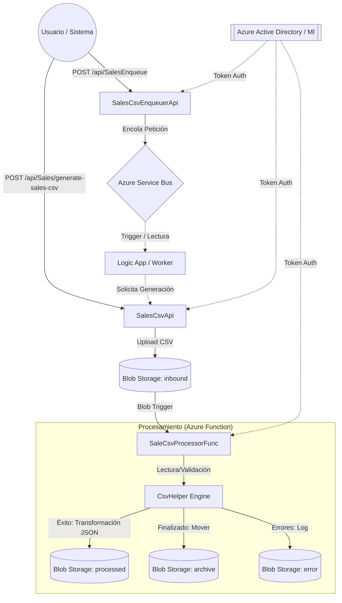

# Rest-Azure (Bri.Azure.Practica)

## 1. Resumen Funcional
El proyecto **Rest-Azure (Bri.Azure.Practica)** es un sistema distribuido diseñado para la **generación, gestión y procesamiento automatizado de reportes de ventas en formato CSV** utilizando servicios nativos de Azure.

*   **Generación de Reportes:** Permite solicitar la creación de archivos CSV de ventas basados en rangos de fechas. Estos archivos se generan dinámicamente y se almacenan en la nube.
*   **Gestión de Tareas (Encolamiento):** Proporciona una interfaz para programar o encolar solicitudes de procesamiento de ventas, permitiendo un manejo asíncrono y escalable de las peticiones.
*   **Procesamiento Inteligente:** Una vez que un archivo CSV llega al almacenamiento, el sistema lo detecta automáticamente, valida su contenido fila por fila, transforma los datos a formato JSON y organiza los archivos resultantes (procesados, archivados o errores).

## 2. Resumen Técnico
La solución está construida bajo una arquitectura de microservicios y procesamiento orientado a eventos (*Event-Driven*).

*   **Stack Tecnológico:** .NET 6/8 (C#).
*   **Componentes Clave:**
    *   **SalesCsvEnqueuerApi:** Web API que actúa como productor de mensajes hacia **Azure Service Bus**. Soporta programación de tareas en el tiempo (*Scheduled Messages*).
    *   **SalesCsvApi:** Web API encargada de la lógica de negocio para generar CSVs y subirlos a **Azure Blob Storage**.
    *   **SaleCsvProcessorFunc:** Azure Function con un *Blob Trigger*. Realiza la ingesta de datos usando `CsvHelper`, validación lógica y salida hacia contenedores JSON.
    *   **SalesCsv.Domain:** Librería de clases compartida con modelos de datos y payloads (POCOs).
*   **Seguridad:** Implementación de **Managed Identity (DefaultAzureCredential)** para comunicación segura entre servicios sin necesidad de almacenar secretos (connection strings) en el código.
*   **Infraestructura (Azure):**
    *   **Storage Account:** Contenedores para `inbound`, `processed`, `archive` y `errors`.
    *   **Service Bus:** Colas para desacoplamiento de procesos.
    *   **App Service / Azure Functions:** Hosting escalable.

---

## 3. Diagrama de Arquitectura

### Detalle de los Contenedores de Storage:
1.  **filescsv / inbound:** Recibe los archivos CSV originales.
2.  **processed:** Almacena el resultado de la transformación en formato `.json`.
3.  **filecsv-archive:** Repositorio histórico de archivos procesados.
4.  **filecsv-error:** Logs detallados de errores de validación por cada archivo fallido.
